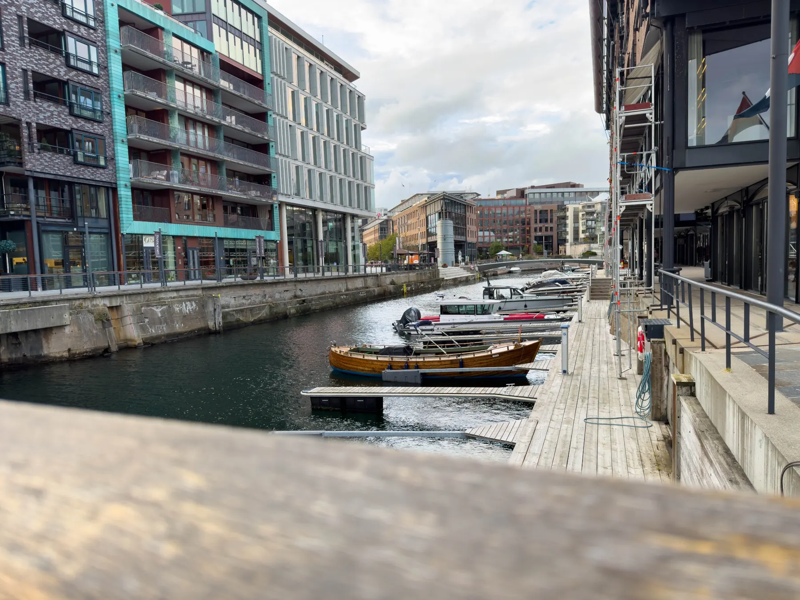
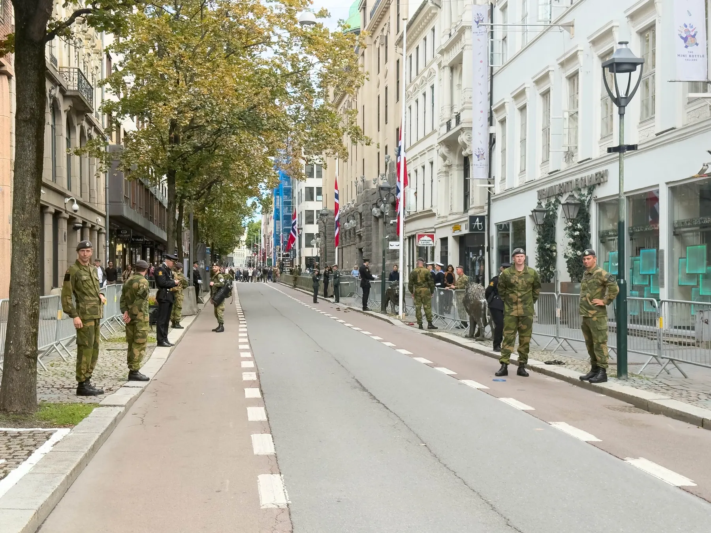
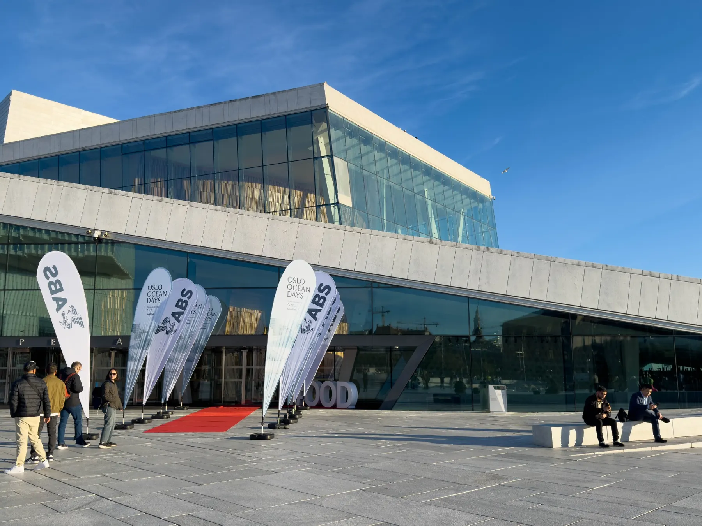


An international maritime conference and professional commitments brought me to Oslo during a week of national mourning.


## Arrival in Oslo

I left Boston at 10:00 PM EDT (UTC-4) on Monday, Labor Day, and arrived gate-side at the Oslo airport promptly at 3:30 PM CEST (UTC+2) after my connection in Frankfurt, Germany, 11½ hours later. I was tired, but excited to be on the ground, feeling the expected chill in the air on my first visit to a Scandinavian country, with three days of conference panels and meetings before me.  

The weeks leading up to this trip were not without their tribulations. With the death of Norway's beloved [King Harald V](https://en.wikipedia.org/wiki/Harald_V) on August 28, the details around his state funeral and the resultant shutdown of the city of Oslo had many of my plans up in the air, so unlike many overseas trips, *just getting there* didn't quite feel like half the battle: I still didn't know how, or *if*,  the week would play out. 

Doing my best to both explore and exhaust myself into sleeping in sync with my adopted time zone, six hours ahead of home, I spent much of the late afternoon and early evening walking Oslo's streets and waterfront. I found roads and wharves steeped in proud maritime tradition: Oslo is the capital of the [world's fifth-largest shipping nation by fleet value](https://www.rederi.no/contentassets/4eef0bd6cd654e66ae09ad812c14a143/kr2026-eng-web-oppdatert.pdf#page=8), part of a maritime industry built on the legacy of [over a millennium of trade by sea](https://www.norges-bank.no/en/news-events/news/Speeches/2017/2017-05-30-lofoten/). 

Somewhere around mile six or eight I was graced with the unique experience of being mugged by a *large* Norwegian seagull for my half-eaten single-scoop chocolate gelato cone along the waterfront, to (undoubtedly) the delight of locals watching (the half I had, however, was *excellent*). 

As I made it back to the hotel, the preparations for the following day were becoming more apparent, with a heavy police presence throughout my route. 

## A City in Mourning

On Wednesday morning, the city of Oslo came to a halt, with over 6,500 Norwegian police and military personnel involved in the day's security and ceremonial duties, and checkpoints, patrols, and crowd control barriers protecting world leaders and locals observing the funeral procession which carried the King from the Royal Palace to Oslo Cathedral and onward to [Akershus Fortress](https://en.wikipedia.org/wiki/Akershus_Fortress) on the waterfront. The event represented the [single largest security operation in Norway's history](https://www.newsinenglish.no/2026/09/07/kings-funeral-sets-off-oslos-largest-security-operation-ever/). 

## Shipping in a Time of Crisis

I set out on foot (with downtown public transportation suspended) for [Gamle Logen](https://en.wikipedia.org/wiki/Gamle_Logen), the historic venue of day one of [Oslo Ocean Days](https://oslooceandays.com), to participate in a distinctly Norwegian conference focused on the contemporary initiatives and challenges of international shipping. The opening panel, made up of industry senior leadership, made no effort to ease into the challenging questions of the day by starting with "Lessons of the Hormuz Crisis". 

For me, as an American, it provided a fascinating discussion on the resiliency of shipping and the geopolitical state of the world from a European perspective that we rarely have the opportunity to see unfiltered.  The responses, from leaders focused on driving innovation and weathering the 'wartime' climate of global commerce with Hormuz at its epicenter, centered on: 

1. the *importance of flexibility and adaptability in shipping*, 
2. the broader *value of the energy transition* (from vessels relying on fossil-fuel-derived power toward alternative fuels) *in reducing exposure to the energy insecurity* created by the Strait shutdown, and  
3. the *safety risks from 'dark fleets'* running cargoes aboard poorly regulated or inadequately maintained vessels through the Strait, and the broader risks of shipping operating outside, or without effective enforcement of, the standards established through the International Maritime Organization (IMO).  

Morning coffee, breaks, and social time provided a great chance to interact with other executives from maritime organizations worldwide, and to connect on the topics relevant to the day or our mutual areas of interest.  

As I traveled back to the hotel later that day, there was an eerie silence over the suspended city as security checkpoints screened tens of thousands entering the downtown area to pay their respects to Norway's late head of state. 

I had never walked a major city with roadways blocked and businesses closed mid-day; it was both a significant and moving time to be in Oslo, and while I was out of place as a foreigner with no ties to King or country, I was honored to have been present in that moment in history, with great respect for the people to whom he mattered greatly. 

## Meetings and Gala Dinner

Thursday brought me to substantive meetings across a restored-to-normal Oslo with colleagues whom I had only connected with via video conference for years. In modern business there is an oddness to 'meeting' someone you've *known* but have never *met*: it feels both like an introduction and a reunion, with something of the joy of each. 

The evening brought the gala dinner of Oslo Ocean Days at the [Oslo Opera House](https://en.wikipedia.org/wiki/Oslo_Opera_House): a first-class, formal event with outstanding food and intimate interludes featuring arias performed by Norwegian National Opera soloist Victoria Randem. This was my first experience with opera and her performance was strikingly beautiful. The dinner was a great way to further connect with the other conference delegates and wind down from a heavy and productive week.

With business concluded and early flights the next morning, my Oslo trip was wrapped up, with mementos split between my carry-on and checked luggage (if my son doesn't get something small from the trip, did I even go?). 

## Looking Back, and Forward

While it would be wildly inappropriate to over-generalize or categorize (good or bad), I had a great experience with the people of Norway, whether they were my local Norwegian counterparts at the conference and in meetings, people I greeted on the street, or the service staff at the hotel and restaurants.  I was very pleased to talk with people, both native Norwegians and expatriates, about Oslo, the buildings we occupied and their histories, their sadness and thoughts on King Harald V's death, and what life in and out of the city is like one-seventh of the way around the Earth from my home. The ease with which the Norwegians I encountered switched to English made Norway an extremely friendly country in which to work (as a monolingual American), and saved us all from my butchered attempts at Norwegian after a few 13-minute stints on YouTube attempting to master the language. 

Professionally, I am eager to spend more time among my colleagues in Norway and learn from their knowledge and innovation. Personally, it's what I didn't see that draws me back the most: the fjords, mountains, and forests have an undeniable pull. However, if this proves to be my only visit, Oslo provided an outstanding glimpse of the wider country in which maritime history, modern industry, and (especially in the case of this trip) national identity are proudly intertwined. 


